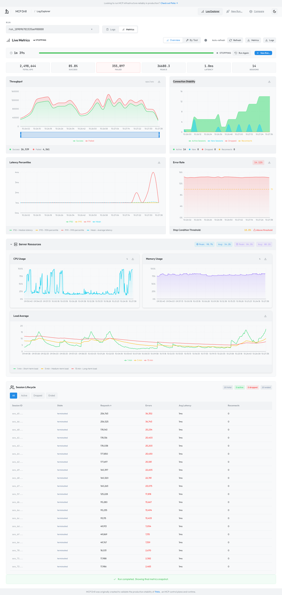
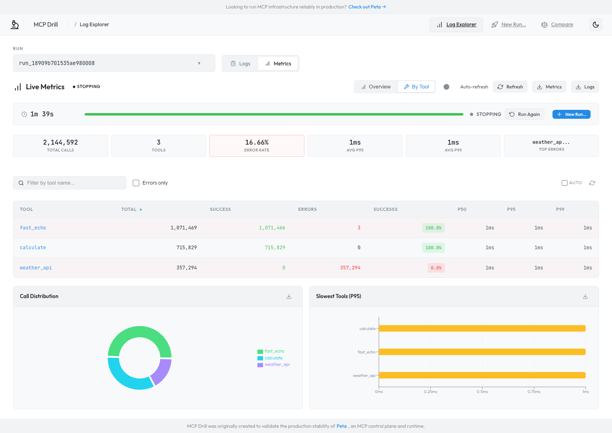

# MCP Drill

A high-performance stress testing platform for MCP servers and gateways.

[](https://go.dev/)
[](LICENSE)

**Simulate thousands of concurrent MCP clients, identify performance bottlenecks, and validate your infrastructure before production.**

> Built to battle-test [Peta](https://github.com/dunialabs/peta-core), an MCP control plane and runtime. If you're building MCP infrastructure, MCP Drill helps you break it before your users do.

## Why MCP Drill?

- **Self-Contained** - Run everything on your own infrastructure. No external services, no cloud dependencies
- **Realistic Load Simulation** - Configurable operation mixes with weighted tool selection
- **Multi-stage Testing** - Preflight, baseline, ramp-up, and soak stages
- **Real-time Observability** - Live metrics dashboard with SSE streaming
- **Distributed** - Scale horizontally with multiple workers
- **Safety First** - Built-in stop conditions prevent runaway tests

## Architecture

```
┌──────────────────────────────────────────────────┐
│                    Control Plane                 │
│  ┌────────────┐  ┌────────────┐  ┌────────────┐  │
│  │Run Manager │  │ Scheduler  │  │  HTTP API  │  │
│  └────────────┘  └────────────┘  └────────────┘  │
└─────────────────────────┬────────────────────────┘
                          │
            ┌─────────────┼─────────────┐
            │             │             │
      ┌─────┴─────┐ ┌─────┴─────┐ ┌─────┴─────┐
      │  Worker   │ │  Worker   │ │  Worker   │
      │ (VU Pool) │ │ (VU Pool) │ │ (VU Pool) │
      └─────┬─────┘ └─────┬─────┘ └─────┬─────┘
            │             │             │
            └─────────────┼─────────────┘
                          │
                   ┌──────┴──────┐
                   │ MCP Target  │
                   └─────────────┘
```

| Component | Role |
|-----------|------|
| **Control Plane** | Manages test runs, schedules work, serves the API and Web UI |
| **Worker** | Spawns virtual users (VUs) that execute MCP operations against the target |
| **Mock Server** | Built-in MCP server with 27 tools for isolated testing — [tool guide](docs/tool-testing-guide.md) |
| **Telemetry Agent** | *(Optional)* Server-side CPU/memory monitoring — [setup guide](docs/agent-telemetry.md) |

## Screenshots

Real-time performance monitoring with throughput, latency percentiles, error rates, and server resource utilization:



Per-tool breakdown with success rates, latency distribution, and error analysis:



## Quick Start

### Option A: Docker (Recommended)

**Prerequisites**: Docker Engine + Docker Compose v2 (`docker compose`).  
If you see build warnings, also ensure Buildx is installed (`docker buildx version`).

```bash
git clone https://github.com/bc-dunia/mcpdrill.git
cd mcpdrill

# Core (server + worker)
docker compose up -d

# With mock server for testing
docker compose --profile mock up -d

# Full stack (mock + agent)
docker compose --profile full up -d
```

Open **http://localhost:8080/ui/logs/** — the Web UI is embedded in the server.

Scale workers: `docker compose up -d --scale worker=5`

> **Notes**
> - Ports are bound to `localhost` by default (see `docker-compose.yml`). Update the port mappings if you need LAN/remote access.
> - The default compose config runs in insecure mode for local development (`--insecure`, `--insecure-worker-auth`) and enables private-network discovery (`--allow-private-discovery`) for Docker testing. Don’t expose it publicly without enabling auth.
> - API rate limiting is disabled in the default compose config (`--rate-limit=0`) to avoid `429` responses during high-volume telemetry shipping.
> - `--profile full` enables the telemetry agent and uses extra container capabilities for PID discovery. If it’s blocked in your environment, use `--profile mock` and run `mcpdrill-agent` on the MCP host instead.

### Option B: From Source

**Prerequisites**: Go 1.24+, Node.js 18+ (for Web UI)

```bash
git clone https://github.com/bc-dunia/mcpdrill.git
cd mcpdrill
make dev
```

This starts all services on loopback (no auth required):

| Service | URL |
|---------|-----|
| Mock Server | http://localhost:3000/mcp |
| Control Plane | http://localhost:8080 |
| Worker | Auto-connected |

Stop with `make dev-stop`. View logs with `make dev-logs`.

For the Web UI in development mode (with hot reload):

```bash
cd web/log-explorer
npm install
npm run dev
```

Open **http://localhost:5173**. Or build and embed into the server: `make frontend` then restart the server to access at `/ui/logs/`.

### Run a Test

Click **"New Run"** in the Web UI to create and start a test using the built-in wizard.

Or via CLI:

```bash
curl -X POST http://localhost:8080/runs \
  -H "Content-Type: application/json" \
  -d "{\"config\": $(cat examples/quick-start.json)}"

# Start the run (replace with your run_id from the response)
curl -X POST http://localhost:8080/runs/{run_id}/start
```

Results appear in real time in the Web UI dashboard.

> **Note**: The quick-start config targets `http://127.0.0.1:3000/mcp` (IPv4). Using `localhost` may fail due to IPv6 resolution on some systems.

> **Optional: Server Resources (CPU/Memory)**  
> The Web UI can display server-side CPU/memory metrics, but this requires the optional `mcpdrill-agent`. The quick-start config has `server_telemetry.enabled: false` by default. To enable it, see [Server Telemetry Agent](#server-telemetry-agent-optional) section below.

## Key Features

| Feature | Description |
|---------|-------------|
| **Virtual Users (VUs)** | Simulate concurrent MCP clients with weighted operation mixes |
| **Session Modes** | `reuse`, `per_request`, `pool`, `churn` |
| **Stop Conditions** | Auto-stop on error rate, latency thresholds |
| **Mock Server** | 27 built-in tools for isolated testing |
| **Web UI** | Real-time dashboard, log explorer, run wizard |
| **OpenTelemetry** | *(Optional)* Distributed tracing with OTLP export |

## Mock Server

MCP Drill includes a built-in mock MCP server with 27 tools for isolated testing without external dependencies.

### Available Tools

| Category | Tools |
|----------|-------|
| **Basic** | `fast_echo`, `slow_echo`, `error_tool`, `timeout_tool`, `streaming_tool` |
| **Data Processing** | `json_transform`, `text_processor`, `list_operations`, `validate_email`, `calculate`, `hash_generator` |
| **API Simulation** | `weather_api`, `geocode`, `currency_convert` |
| **File Operations** | `read_file`, `write_file`, `list_directory` |
| **Stress Testing** | `large_payload`, `random_latency`, `conditional_error`, `degrading_performance`, `flaky_connection` |
| **Resilience** | `rate_limited`, `circuit_breaker`, `backpressure`, `stateful_counter`, `realistic_latency` |

### Verify It Works

Make sure the mock server is running (e.g. `docker compose --profile mock up -d` or `make dev`) before calling `localhost:3000`.

```bash
# List available tools
curl -X POST http://localhost:3000/mcp \
  -H "Content-Type: application/json" \
  -d '{"jsonrpc":"2.0","method":"tools/list","id":1}'

# Call a tool
curl -X POST http://localhost:3000/mcp \
  -H "Content-Type: application/json" \
  -d '{"jsonrpc":"2.0","method":"tools/call","params":{"name":"fast_echo","arguments":{"message":"hello"}},"id":2}'
```

See [`examples/quick-start.json`](examples/quick-start.json) for a complete test configuration. Full tool documentation: [Tool Testing Guide](docs/tool-testing-guide.md).

## Server Telemetry Agent (Optional)

> **Note**: MCP Drill works perfectly without the telemetry agent. This is an optional add-on for correlating client-side load test metrics with server-side resource usage.

Monitor server-side metrics (CPU, memory, threads, file descriptors) from your MCP server during load tests.

```
┌─────────────────────────────┐          ┌─────────────────────────┐
│   Your MCP Server Host      │          │   Control Plane         │
│                             │          │                         │
│  MCP Server   mcpdrill-agent│─────────▶│  Correlates metrics     │
│  (port 3000)       │        │  HTTPS   │  with test runs         │
│       ▲            │        │          │                         │
│       └── monitors─┘        │          │                         │
└─────────────────────────────┘          └─────────────────────────┘
```

### Quick Setup

```bash
# Build the agent
make agent

# Enable on control plane
./mcpdrill-server --addr :8080 --enable-agent-ingest --agent-tokens "secret-token"

# Run agent on your MCP server host
./mcpdrill-agent \
  --control-plane-url http://localhost:8080 \
  --agent-token "secret-token" \
  --pair-key "my-test" \
  --listen-port 3000
```

### Link with Test Runs

```json
{
  "scenario_id": "capacity-test",
  "server_telemetry": {
    "enabled": true,
    "pair_key": "my-test"
  },
  "target": { "url": "http://localhost:3000/mcp" }
}
```

> **What is `pair_key`?**  
> The pair key links metrics from a specific server with your test runs. Use the **same value** for `--pair-key` when starting the agent and in your run config's `server_telemetry.pair_key` to correlate server-side resource metrics (CPU, memory) with client-side load test results.

See [Agent Telemetry Guide](docs/agent-telemetry.md) for full details.

## API Quick Reference

```bash
# Create a run
curl -X POST http://localhost:8080/runs -H "Content-Type: application/json" -d @config.json

# Start / Stop / Emergency stop
curl -X POST http://localhost:8080/runs/{run_id}/start
curl -X POST http://localhost:8080/runs/{run_id}/stop -d '{"mode":"drain"}'
curl -X POST http://localhost:8080/runs/{run_id}/emergency-stop

# Status and events
curl http://localhost:8080/runs/{run_id}
curl -N http://localhost:8080/runs/{run_id}/events
```

## Docker

### Images

| Image | Description |
|-------|-------------|
| `mcpdrill/server` | Control plane + embedded Web UI (`go:embed`) |
| `mcpdrill/worker` | Distributed load worker |
| `mcpdrill/mockserver` | Built-in MCP mock server (27 tools) |
| `mcpdrill/agent` | Server-side telemetry agent (optional) |

### Compose Profiles

```bash
docker compose up -d                       # server + worker
docker compose --profile mock up -d        # + mock server
docker compose --profile full up -d        # + mock server + agent
docker compose up -d --scale worker=5      # scale workers
```

### Build Images

```bash
make docker-build                          # all images
make docker-build VERSION=v0.1.0           # with version tag
make docker-server                         # server only
```

Images are automatically published to GHCR on tag push via GitHub Actions.

## Documentation

| Topic | Link |
|-------|------|
| Getting Started | [docs/getting-started.md](docs/getting-started.md) |
| CLI Reference | [docs/cli.md](docs/cli.md) |
| Configuration | [docs/configuration.md](docs/configuration.md) |
| API Reference | [docs/api.md](docs/api.md) |
| Web UI | [docs/web-ui.md](docs/web-ui.md) |
| Mock Server & Tools | [docs/tool-testing-guide.md](docs/tool-testing-guide.md) |
| Server Telemetry Agent | [docs/agent-telemetry.md](docs/agent-telemetry.md) |
| OpenTelemetry | [docs/opentelemetry.md](docs/opentelemetry.md) |
| Multi-Node Deployment | [docs/multi-node-deployment.md](docs/multi-node-deployment.md) |
| Plugins | [docs/plugins.md](docs/plugins.md) |
| Troubleshooting | [docs/troubleshooting.md](docs/troubleshooting.md) |
| Development | [docs/development.md](docs/development.md) |

## Examples

Pre-built configs in [`examples/`](examples/):

- [`quick-start.json`](examples/quick-start.json) - Minimal test against mock server
- [`tool-testing/`](examples/tool-testing/) - Tool validation scenarios
- [`scenarios/`](examples/scenarios/) - SSE and streaming tests
- [`multi-node/`](examples/multi-node/) - Docker Compose and Kubernetes

## License

MIT License - see [LICENSE](LICENSE) for details.

---

<sub>MCP Drill was originally created to validate the production stability of [Peta](https://github.com/dunialabs/peta-core), an MCP control plane and runtime. If you're building MCP infrastructure that needs to scale, Peta handles the hard parts — routing, auth, observability — so you can focus on your agents.</sub>
